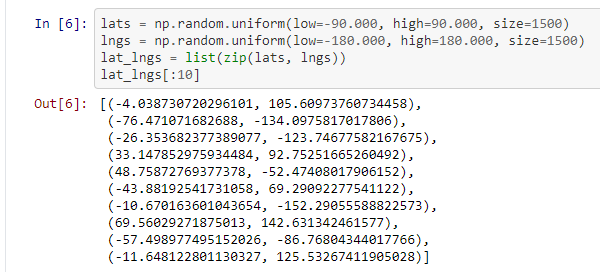
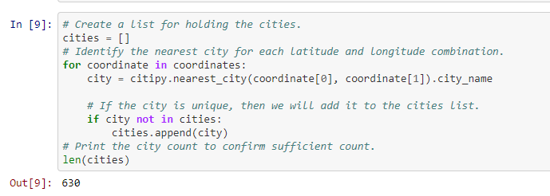
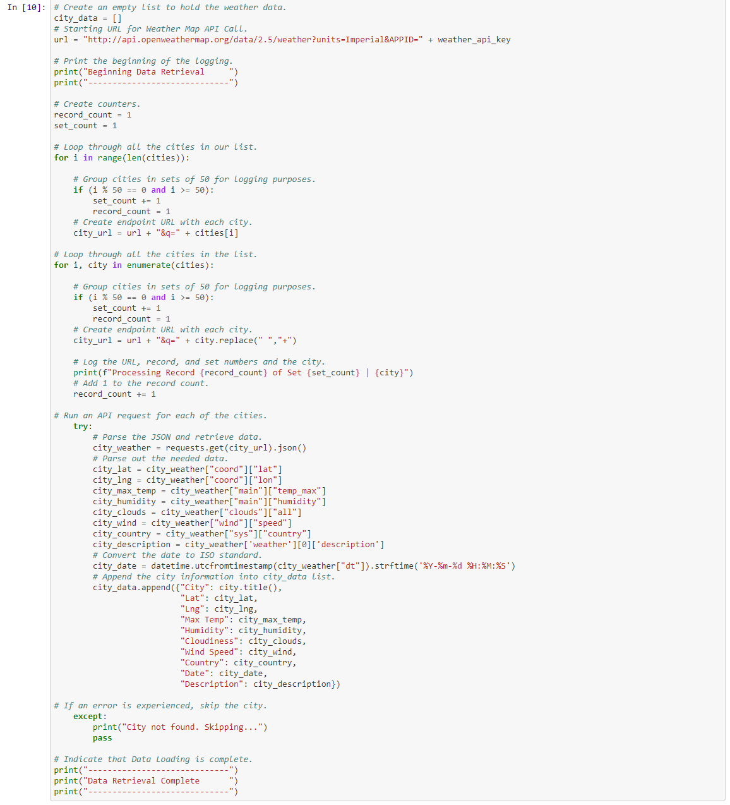
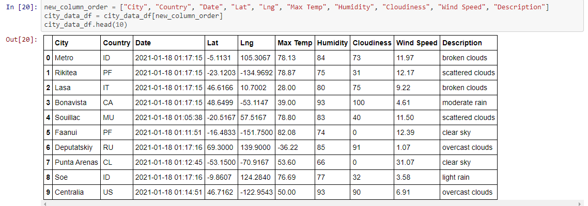
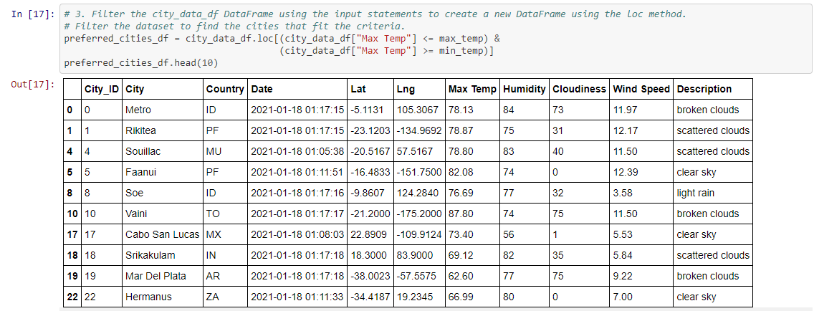
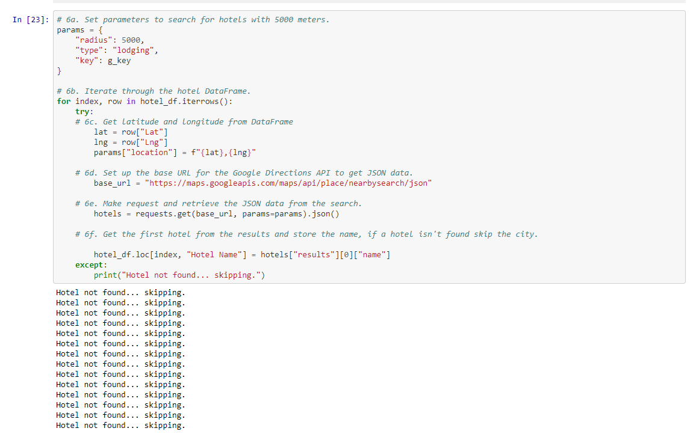
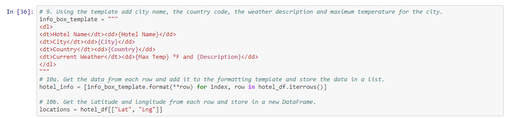
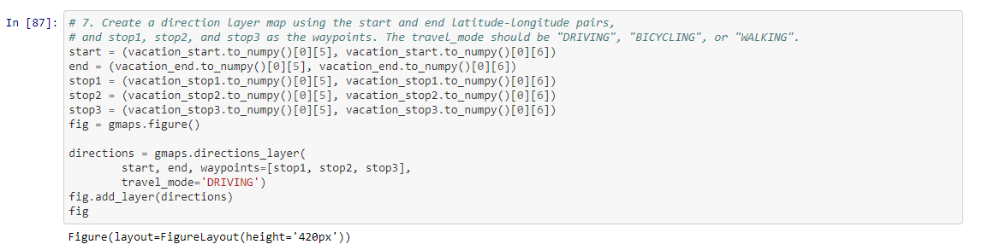
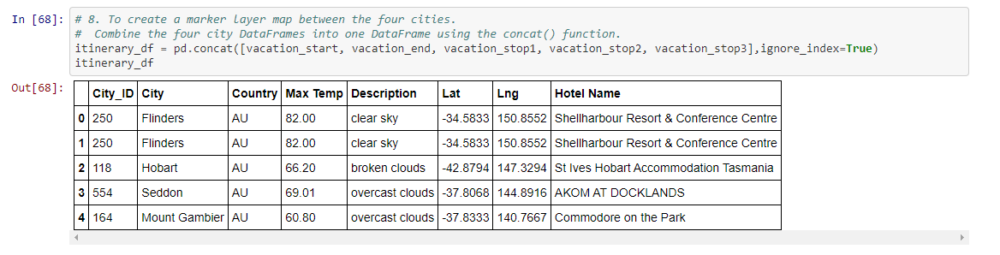

# World_Weather_Analysis
Columbia Data Science Module 6

## Overview of Analysis

This project utilizes Openweather API to pull weather data for 2000 randomly generated coordinates. Using citipy, the nearest cities to these coordinates were collected. Following this, I used Google Maps API to pull the names of hotels near the selected cities. The end result for the user is the ability to specify the preferred weather for their next vacation and after this they are provided a map of hotels that meet their specifications. Using the Google maps API, I also created an itinerary for a hypethetical trip between four cities in Australia. 

## Resources
Software: Python 3.8.6, Jupyter Notebook

Python packages: citipy, gmaps, requests, pandas, matplotlib, numpy, datetime

APIs: OpenWeatherMap, Google Maps

## Building the App

### Creating the Weather Database

The first step in creating the app was pulling weather data. To start, I randomly generated 1500 pairs of longitudinal and latitudinal coordinates using the code below: 

 

Next, using citipy, I retrieved the nearest city to each coordinate. Some random coordinates were in uninhabited areas like the ocean or Antarctica. Additionally, I specified that only unique cities should be added to the list of cities. 

 

This left 630 cities in the cities list. The OpenWeather API was then used to pull the weather for each of the cities in that list using the code below: 

 

After converting the data to a data frame and reordering the columns, we are left with this: 

 

I then exported the data frame as [WeatherPy_Database.csv](https://github.com/perryabdulkadir/World_Weather_Analysis/blob/main/Weather_Database/WeatherPy_Database.csv) and saved it to the Weather_Database folder.

### Creating a Customer Travel Destinations Map

After loading the WeatherPy_Database.csv into the Vacation_Search.ipynb, I wrote code prompting users to select their minimum and maximum preferred temperatures. 

```
min_temp = float(input("What is the minimum temperature you would like for your trip? "))
max_temp = float(input("What is the maximum temperature you would like for your trip? "))
```

Next, I used the loc method the filter the data frame based on the user's inputs. 

 

Then, I created a clean version of the data frame by dropping empty rows.
```
clean_df = preferred_cities_df[preferred_cities_df['Country'].notna()]
```

After preparing clean_df, I created a data frame identical to clean_df but with an empty column called "Hotel Name." This new dataframe is called hotel_df.

```
# 5a. Create DataFrame called hotel_df to store hotel names along with city, country, max temp, and coordinates.
hotel_df = clean_df[["City", "Country", "Max Temp", "Description", "Lat", "Lng"]].copy()

# 5b. Create a new column "Hotel Name"
hotel_df["Hotel Name"] = ""
```
 
With the hotel_df ready, I created a function called Google Maps API and requested "lodging" within 5km of latitude/longitude of every city. The function pulled the first hotel listed and saved the names in JSON format. I created an exception so if there was no hotel within 5km it would print "Hotel not found... skipping."

 

After exporting the [resulting data frame](https://github.com/perryabdulkadir/World_Weather_Analysis/blob/main/Vacation_Itinerary/WeatherPy_vacation.csv) to .csv with the city as the index, I wrote a function that filled each map marker with information about the hotel. 

 

Finally, I used the GMaps Python package to place each hotel as a marker on a global map. 
```
# 11a. Add a marker layer for each city to the map. 
locations = hotel_df[["Lat", "Lng"]]
max_temp = hotel_df["Max Temp"]
fig = gmaps.figure(center=(30.0, 31.0), zoom_level=1.5)
marker_layer = gmaps.marker_layer(locations, info_box_content=hotel_info)
fig.add_layer(marker_layer)
# 11b. Display the figure
fig
```

 


### Creating a Travel Itinerary Map

The first step of creating the travel itinerary map was importing dependencies, the GMaps API key, and reading in WeatherPy_vacation.csv as vacation_df. I then had to choose four cities in the same country to create a road trip connecting them all. I chose four Australian towns: Flinders, Hobart, Seddon, and Mount Gambier.

I created five dataframes: one for each stop on the trip (the start, end, first stop, second stop, and third stop). It was a circular trip starting and ending in Flinders, so I used the loc method to set vacation_start and vacation_end equal to the Flinders row of vacation_df. 

```
vacation_start = vacation_df.loc[vacation_df["City"] == "Flinders"]
vacation_end = vacation_df.loc[vacation_df["City"] == "Flinders"]
```

The same strategy was repeated for the other three stops on the journey. Next, I retrieved the latitude-longitude pairs for each city from their respective dataframes as tuples using the to_numpy function and list indexing.

```
start = (vacation_start.to_numpy()[0][5], vacation_start.to_numpy()[0][6])
end = (vacation_end.to_numpy()[0][5], vacation_end.to_numpy()[0][6])
stop1 = (vacation_stop1.to_numpy()[0][5], vacation_stop1.to_numpy()[0][6])
stop2 = (vacation_stop2.to_numpy()[0][5], vacation_stop2.to_numpy()[0][6])
stop3 = (vacation_stop3.to_numpy()[0][5], vacation_stop3.to_numpy()[0][6])
```

Subsequently, using the GMaps package, I created a map using the cities as waypoints.

 

In order to incorporate the informational marker pop-up functionality from the travel destination map section, I first combined the four cities' data frames into one.

 


## Summary


-----

### **Contact:**

**Email:** perry.abdulkadir@alumni.harvard.edu

**Linkedin:** https://www.linkedin.com/in/perry-abdulkadir-6a255199/
